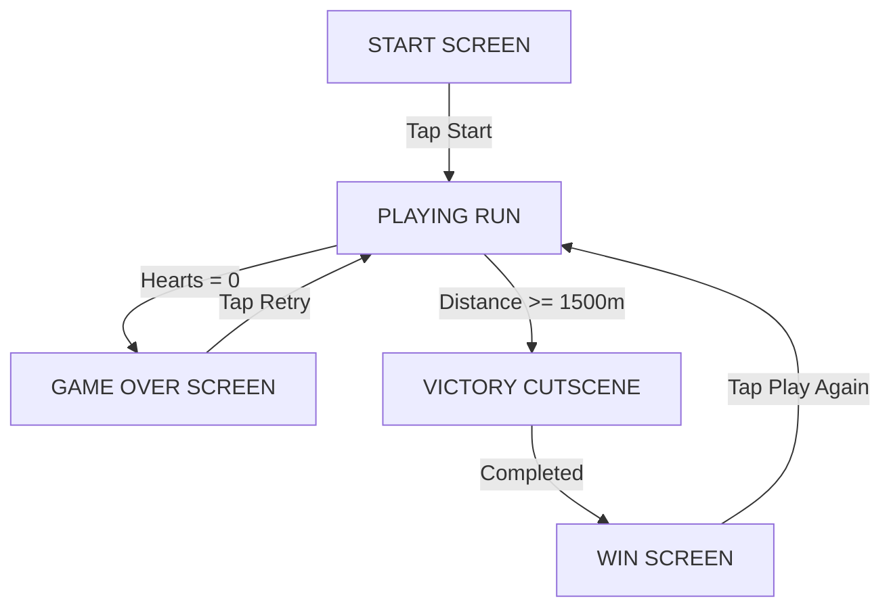

# Game Architecture: Ghada's Journey

This document explains the technical design, mechanics, systems, and algorithms driving the game.

---

## 1. Engine & State Machine

The game runs on a single-threaded JavaScript architecture using a classic game loop powered by `requestAnimationFrame`. 

### State Machine
The game loop executes different rendering and updating pipelines based on the current state:


---

## 2. Canvas Scaling & Viewport Mapping

To ensure the game feels identical and runs with uniform difficulty across all phones, we implement a **logical resolution lock**:
* The canvas logical width is fixed at **$360\text{px}$**.
* The canvas logical height is fixed at **$640\text{px}$** ($9:16$ vertical aspect ratio).
* Using CSS styling, the canvas is scaled to fill the viewport while retaining its aspect ratio:
  ```css
  #gameCanvas {
    width: 100%;
    height: 100%;
    object-fit: contain;
  }
  ```
* Mouse and touch coordinates are mapped directly to this logical coordinate system.

### Background Aspect Ratio Preservation
Because the game runs on a fixed 9:16 portrait canvas (360x640), but backgrounds are often generated as 1:1 squares (e.g. 1024x1024), we dynamically compute the drawing width to prevent horizontal squishing:
```javascript
const drawnWidth = bgImg.width * (CANVAS_HEIGHT / bgImg.height);
```
The game engine then smoothly scrolls and loops the background using this dynamic `drawnWidth` rather than the rigid `CANVAS_WIDTH`.

---

## 3. Ground Shadow

To increase the visual contrast and sense of depth:
* **Jumping Shadow**: A flat black ground oval is drawn beneath Ghada, shrinking in scale as she jumps higher to give a sense of depth and verticality. (Note: We removed universal Canvas drop-shadows on image sprites because they aggressively amplified invisible compression halos, leading to unsightly "boxes" around characters).

---

## 4. Balanced Physics Model

The physics coefficients have been carefully tuned to accommodate the scaled-up character sizes ($68 \times 68$ pixels):

### Ground Runner Mode (All Stages)
* Ghada runs on a ground height level of $Y = 480$ (adjusted from $520$ to fit taller sprites).
* Tapping applies a vertical launch velocity impulse (jump force $V_y = -13.0$).
* Gravity ($g = 0.48$) pulls her back down.
* Peak jump height is approximately **$176\text{px}$** of clearance, enabling her to jump over the tallest $70\text{px}$ obstacles while providing enough horizontal float time to clear wide obstacles like cabs.
* **Foraging items**: Scale to $32 \times 32$ pixels.

---

## 5. Dynamic Corner-Pixel Transparency Keying

To handle sprite images generated on both white and black backgrounds without manual editing, we implement a dynamic transparency key-out filter. On load, the system samples the color of the top-left pixel and keys out matching pixels using Euclidean distance and a soft-alpha blend to smooth edges and prevent jagged halos:

```javascript
const tolerance = 50;
const fadeRange = 40;

if (bgA > 10) { // Check if corner is opaque
  for (let i = 0; i < data.length; i += 4) {
    const diff = Math.sqrt(Math.pow(data[i]-bgR, 2) + Math.pow(data[i+1]-bgG, 2) + Math.pow(data[i+2]-bgB, 2));
    
    if (diff < tolerance) {
      data[i + 3] = 0; // Fully transparent
    } else if (diff < tolerance + fadeRange) {
      // Soft blending for anti-aliased edge pixels
      const alphaRatio = (diff - tolerance) / fadeRange;
      data[i + 3] = Math.floor(alphaRatio * 255);
    }
  }
}
```

---

## 6. Web Audio API Chiptune Synthesizer

We avoid network latency and heavy audio asset downloads by synthesizing sound effects directly using Web Audio oscillators.

### Sound Definitions:
1. **Jump Sound**: A `triangle` wave oscillator that sweeps from $150\text{Hz}$ to $600\text{Hz}$ over $0.15$ seconds, using an exponential ramp.
2. **Flap Sound**: A smooth `sine` wave oscillator sweep from $220\text{Hz}$ to $440\text{Hz}$ over $0.10$ seconds.
3. **Hurt Sound**: Generates a custom `AudioBuffer` filled with white noise, fed through a low-pass filter sliding from $1000\text{Hz}$ down to $100\text{Hz}$ to create a crunchy, retro crash.
4. **Heal Sound**: Play a dual-note arpeggio (C5 followed by E5) using a `square` wave.
5. **Victory Fanfare**: A sequenced array of notes mapping a romantic, happy chiptune melody.

---

## 7. Collision & Spawning Layouts

* **Hitboxes**: We use Axis-Aligned Bounding Box (AABB) collisions. To make gameplay arcade-forgiving, we apply a significant padding threshold:
  ```javascript
  const paddingX = 18; // Make side hitboxes 36px thinner than visual width
  const paddingY = 12; // Make vertical hitboxes 24px shorter than visual height
  ```
  This permits visual overlaps (e.g. grazing the edge of a taxi) without taking damage.
* **Stage Spawning**: Tracks distance. Stage spans trigger different obstacle schedules. Flying obstacles (birds, clouds) spawn scattered across the entire sky ($[60, 420]$ logical pixels) rather than clustered at the top.
* **Programmatic Heart Renderer**: Spawns healing heart items drawn via a pixelated $8\times 8$ grid of pink/red (or teal on full health) squares.
* **Cutscene Triggers**: At $1,500\text{m}$, the scroll stops. Ghada walks forward automatically. The husband sprite moves in from the right hand side in front of the Westchester home. Heart particles explode, and the win menu is triggered.
